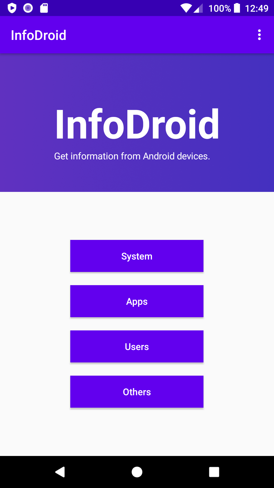

# InfoDroid

Get information from *Android* devices. **Just for learning ONLY**.

## Tools

* Android Studio 3.5+
* Java
* Android SDK 23+
    * Best for 29

## Development

* You can use [OkHttp](https://square.github.io/okhttp/) to access the Internet.
* You can get information asynchronously, then (put the information in `results`) use `adapter.notifyDataSetChanged();` to refresh UI.
* SQLite supported, you can save and get data by class `InformationDao`.

## Preview

